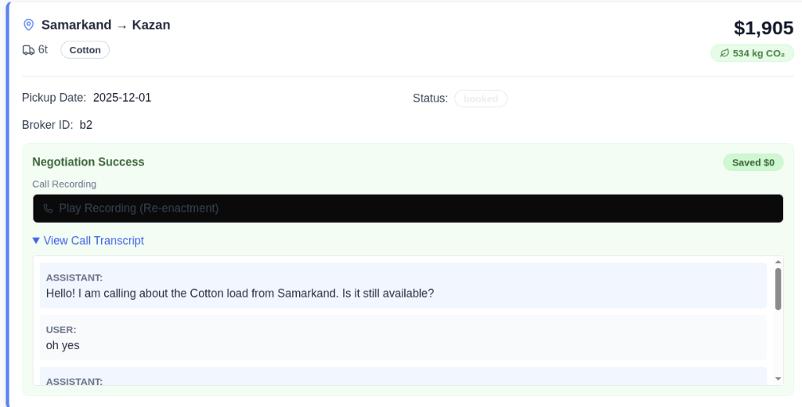

# AI Logistics Broker Agent

A Next.js application featuring an AI-powered Voice Agent for freight negotiation.

## Features
- **AI Voice Agent**: Negotiates freight rates using OpenAI GPT-4 and ElevenLabs/Muxlisa TTS.
- **Multi-language**: Supports English, Russian, and Uzbek (with native pronunciation).
- **Sustainability**: Tracks CO2 savings for each load.
- **Logs & Analytics**: Full conversation transcripts and audio re-enactment.

## Call Logs & Transcript Example

## Getting Started

First, run the development server:

\`\`\`bash
npm run dev
\`\`\`

Open [http://localhost:3000](http://localhost:3000) with your browser to see the result.

## Environment Setup
Create a \`.env.local\` file with:
\`\`\`bash
OPENAI_API_KEY=sk-...
ELEVENLABS_API_KEY=...
MUXLISAI_API_KEY=...
\`\`\`
